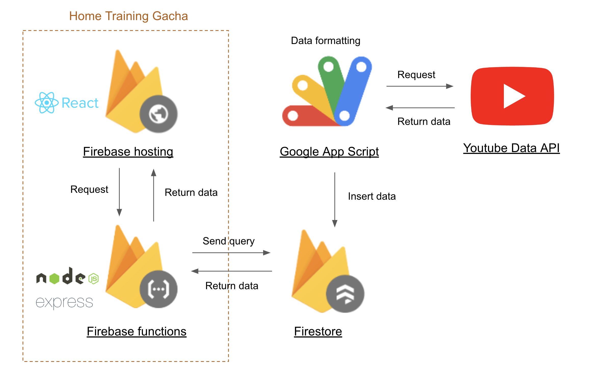

# Home Training Gacha

## Requirements
- Google Account
- node(v16.x)
- npm
- yarn
- firebase CLI
  - Install below command
  ```
  npm i -g firebase-tools
  ```
## Setup
### Firebase Project Setup
#### Create Firebase Project
- Log in [Firebase console](https://console.firebase.google.com/u/0/), click **[Create Project]** and follow instructions to create a project
- After create project, change Firebase charge plan from "Spark" (free plan) to "Blaze" (pay-per-use plan)

#### Create Service Account Key
- Move to project settings > service account
  - URL: https://console.firebase.google.com/u/0/project/{YOUR_PROJECT_NAME}/settings/serviceaccounts/adminsdk
- Select **[Firebase Admin SDK]**
- Click **[Generate new private key]** to download json file
- Rename downloaded json file to **serviceAccount.json** and move under the `functions/` directory

### Application Setup
- Execute below shell script
  - Update `node_modules/` directory and generate `.env.dev`, `.env.prod` file in each directory in `client/` and `functions/`
```
sh first_setup.sh
```

### Emulate Application Locally
- Login firebase
```
firebase login
```
- Execute shell script for emulate
```
sh ./emulator_dev.sh
```

## Deployment(Firebase)
- Login firebase
```
firebase login
```
- Rewrite `.env.prod` enviroment variable `REACT_APP_API_BASE_URL` in the   `client/` directory
- Rewrite `.env.prod` enviroment variable `CLIENT_BASE_URL` in the   `functions/` directory
- Execute shell script for deploy
```
sh ./deploy_prod.sh
```

## System Structure

